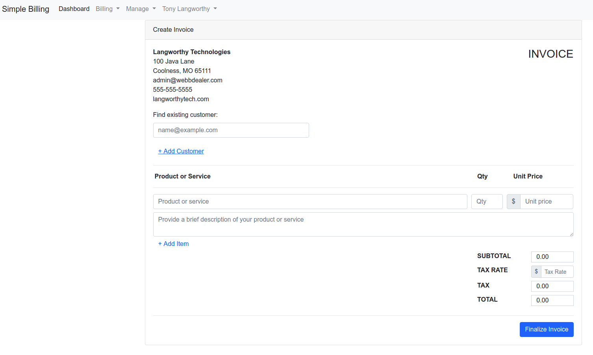

## Simple Billing System

#### About

Simple Billing System allows a user to register, login, and create invoices for customers. Set up billing for
recurring / subscription services as well as one-off services.

### Tech Stack

This is a Java 11 application using the Spring Boot framework with JSP for the front-end.

